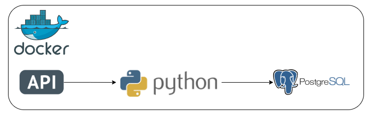

# Projeto de Engenharia de Dados: Ingestão de Dados por API

## Introdução

Este projeto tem como objetivo desenvolver uma automação que seja capaz de coletar dados governamentais por meio de uma API e realizar o armazenamento dos dados coletados em um banco de dados interno relacional. O projeto será implementando utilizando o Python, junto de programação orientado a objetos (POO) e boas práticas de programação. Além disso, o projeto será versionado dentro de um repositório no Github utilizando um padrão de mensagens de commit e de git flow. Por fim, serão implementados testes unitários para validar métodos e funções.

## Tecnologias Utilizadas

- **Python:** Linguagem de programação para fazer requisições à API, processar dados e armazená-los em um banco de dados relacional.
- **Postgres:** Banco de dados relacional para armazenar os dados provenientes da API.
- **Docker:** Utilizado para criar os contêineres que irão hospedar o ambiente Python e o banco de dados Postgres.

 
 
 

## Arquitetura

## Etapas do Projeto

### 1. Estudo da Documentação da API

Realização de um estudo da documentação da API, no caso a Brasil API (https://brasilapi.com.br/docs) para o entendimento de como utilizá-la e realizar as requisições. No caso desta API, as requisições são unicamente do tipo GET, sendo necessário apenas passar parâmetros e, para alguns endpoints, mudar os paths dependendo do estado na qual se queria a informação, por exemplo.

### 2. Desenvolvimento da Lógica para Realizar a Requisição à API

Desenvolvimento da classe [BrasilApi](src/classes/brasil_api.py) para lidar com a interação com a API, incluindo requisições e tratamento de erros. Essa classe possibilita a criação de requisições à API e a geração de nomes de arquivos que posteriormente salvarão o conteúdo da resposta para facilitar a identificação. Além disso, a classe também retorna um dicionário denominado "envelope," o qual contém informações cruciais sobre a requisição.

Isso se torna necessário devido à natureza das respostas da API, que geralmente não incluem detalhes relacionados à solicitação em si. Por exemplo, ao solicitar informações sobre os municípios do estado de São Paulo, a resposta pode conter todos os municípios de São Paulo, mas não fornece informações específicas sobre o estado. Isso pode dificultar a identificação do estado ao inserir informações de vários estados no banco de dados. Portanto, o "envelope" é um dicionário que é incorporado à resposta em formato JSON, servindo como uma espécie de metadados da requisição.

Junto disso, a classe [DirectoryHandler](src/classes/directory_handler.py) foi criada para interagir com o diretório local do computador. Ela oferece a capacidade de criar diretórios, salvar as respostas da API em arquivos JSON e posteriormente ler esses arquivos. Esta classe também é capaz de lidar com o "envelope," permitindo a criação de um arquivo JSON que contenha tanto o conteúdo da requisição em uma chave como o envelope da requisição em outra. Além disso, a classe é capaz de ler arquivos JSON locais e retorná-los como objetos DataFrame, ou então ler arquivos JSON locais que possuam um envelope e retorná-los como um único DataFrame. Isso é particularmente útil, pois cada metadado do envelope se torna uma coluna no DataFrame, simplificando a identificação e análise dos dados. 

### 3. Automação de Várias Requisições

Quando é necessário obter informações sobre municípios de diferentes estados, várias requisições devem ser feitas, o que pode exigir a criação de inúmeros objetos "BrasilAPI". Para simplificar o processo de requisições com diversos parâmetros, desenvolvemos a classe [OrquestratorAPI](src/classes/api_orquestrator.py) . Essa classe aceita um dicionário de parâmetros contendo listas de parâmetros e/ou caminhos, permitindo a iteração nessas listas. Isso possibilita a realização de várias requisições e o armazenamento dos retornos em arquivos JSON. Com essa classe, abstraímos a necessidade de criar múltiplos objetos "BrasilAPI," tornando simples a criação de parâmetros e/ou paths que contenham a lista de estados desejados. A própria classe cuida de realizar as várias requisições.

Essa lógica nos permitiu efetuar inúmeras requisições à API e salvar os resultados localmente em arquivos JSON. Além disso, incorporamos informações de "envelope" para cada requisição, fornecendo metadados essenciais sobre as solicitações.

### 4. Desenvolvimento da Lógica para Inserir os Dados no Banco de Dados Relacional

Agora será desenvolvido a lógica para inserir os dados no banco de dados relacional. Para isso, utilizamos a classe [Postgres](src/classes/postgres.py), que atua como um conector responsável por interagir com o banco de dados PostgreSQL. Essa classe estabelece uma conexão com o banco e é capaz de executar diversas operações, incluindo seleção de dados, criação de tabelas, remoção de tabelas e inserção de dataframes em tabelas do banco.

Posteriormente, com o auxílio da classe DirectoryHandler, todos os arquivos JSON presentes no diretório de download são lidos e transformados em dataframes. Utilizando a classe Postgres, criamos uma tabela no banco de dados com as colunas necessárias e, em seguida, realizamos a inserção do dataframe. Isso permite que os dados provenientes das requisições à API sejam armazenados de forma organizada em um banco de dados relacional.

### 5. Desenvolvimento dos Testes Unitários

Por fim, com o propósito de testar o programa, foram realizados inúmeros testes unitários dos métodos das classes, sendo os arquivos [test_api_orquestrator.py](tests/test_api_orquestrator.py), [test_brasil_api.py](tests/test_brasil_api.py) e [test_directory_handler.py](tests/test_directory_handler.py). Para isso, contamos com a ajuda da biblioteca PyTest. Além disso, criamos objetos mocks e utilizamos arquivos temporários para simular objetos requests, garantindo assim a realização de testes verdadeiramente unitários. 

*Todos os métodos e classes foram devidamente documentados com docstrings e anotações, com o objetivo de facilitar a compreensão da lógica do código, possibilitando assim um entendimento mais profundo e completo do código caso necessário.

**Observação:** O projeto concentra-se no desenvolvimento da lógica de coleta de dados e posterior armazenamento, e não necessariamente na segurança. Para simplificar o código, não serão criadas variáveis de ambiente para as credenciais, que, em vez disso, serão diretamente incorporadas no código.

## Pré-Requisitos

Antes de prosseguir com este projeto, é necessário ter o Docker Desktop instalado em sua máquina local.

## Executando o Projeto

Siga os passos abaixo para executar este projeto:

1. Copie o diretório do projeto para uma pasta local em seu computador.
2. Abra o terminal do seu computador e mova até o diretório do projeto.
3. Crie a imagem do container do Python executando o seguinte comando: `docker build -t python_image .`
4. Crie os containers do Postgres e Python com o seguinte comando: `docker-compose up -d`. Ao executar o container Python, ele irá executar o script.

## Conclusão

Este projeto de Ingestão de Dados por API representa uma solução completa e automatizada para coletar dados governamentais por meio de uma API e armazená-los em um banco de dados relacional. Durante o desenvolvimento, foi adotado boas práticas de programação e a abordagem de programação orientada a objetos (POO) para criar uma solução robusta.

Utilizamos a linguagem de programação Python como nossa principal ferramenta, permitindo-nos efetuar requisições à API, processar os dados e inseri-los em um banco de dados PostgreSQL. Além disso, empregamos a tecnologia Docker para criar ambientes isolados que hospedam tanto a aplicação Python quanto o banco de dados PostgreSQL.

Foi desenvolvido a classe "BrasilApi" para interagir com a API, gerenciar as requisições e tratar possíveis erros. Além disso, foi implementado a classe "DirectoryHandler," que facilita a organização das respostas da API em arquivos JSON e a sua posterior leitura, incluindo o "envelope" que contém informações essenciais sobre as requisições.

Para automatizar a realização de várias requisições, criamos a classe "OrquestradorAPI," permitindo a iteração em listas de parâmetros e caminhos, simplificando a coleta de dados de vários estados. Com a lógica de coleta de dados pronta, desenvolvemos a classe "Postgres" para efetuar a inserção dos dados no banco de dados relacional PostgreSQL. Utilizamos a classe "DirectoryHandler" para processar os arquivos JSON locais e inserir o conteúdo no banco. Essa abordagem possibilitou o armazenamento eficiente dos dados provenientes das requisições à API. Para garantir a qualidade e robustez da solução, implementamos testes unitários, utilizando a biblioteca PyTest.
